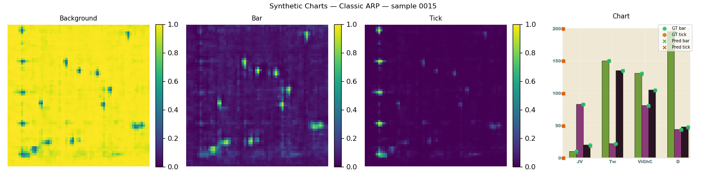
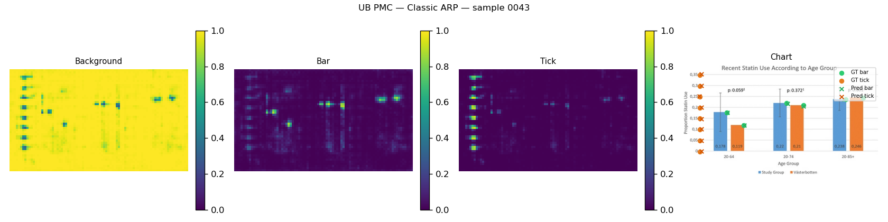
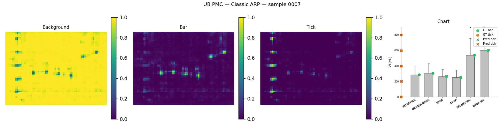
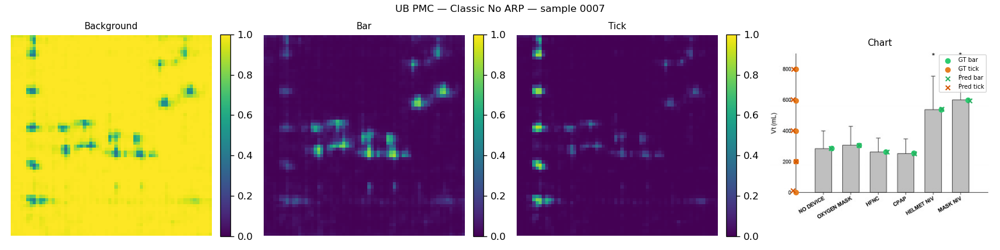
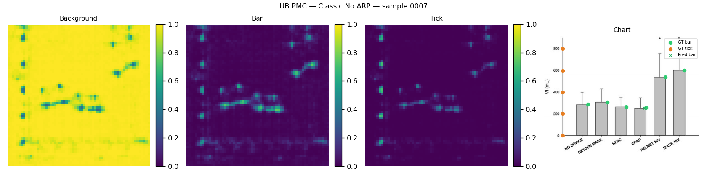
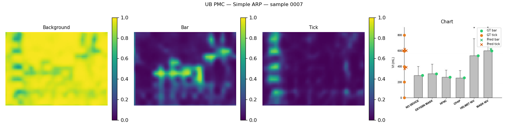

# Bar-JEPA

Per-bar numerical value recovery from vertical bar charts using [I-JEPA](https://github.com/facebookresearch/ijepa) as a self-supervised feature extractor.

A frozen ViT-H encoder produces semantically rich feature maps; a lightweight decoder regresses heatmaps for bar tops, tick marks, and the coordinate system origin. Combining these with PaddleOCR-based tick label matching yields per-bar numerical values without any end-to-end supervision.

**Paper:** *Bar-JEPA: Extracting Values from Bar Chart with Joint-Embedding Predictive Architecture* — P. Poonam, A. Epple, T. Ropinski, Ulm University.




---

## Results

| Model | |
|---|---|
| Real-world FT |  |
| Variable Resolution |  |
| Fixed Resolution |  |
| Vanilla |  |
| Simple Decoder |  |

Full per-category breakdowns and confusion matrices are in [`results/`](results/).

---

## Repository layout

```
bar-gen/          Synthetic bar chart generator
bar-jepa/
  configs/        YAML configs (jepa, keypoint, eval)
  src/
    models/       ViT encoder + classic/simple decoders
    datasets/     Synthetic charts, UB PMC, Chart-to-Text loaders
    masks/        Multi-block masking (I-JEPA & ARP variant)
    utils/        Heatmap helpers, OCR, postprocessing, …
  main.py         Entry point (finetune | decoder | eval)
results/          Evaluation CSVs and confusion matrix plots (committed)
scripts/
  run_all_evals.py  Run all five eval configs in sequence
```

---

## Setup

The project uses [pixi](https://pixi.sh) for environment management (CUDA 12.1 on Windows, MPS on macOS, Linux currently unsupported).

```bash
# install pixi, then:
pixi install
```

Alternatively, install with pip (requires PyTorch ≥ 2.3):

```bash
pip install -e ".[torch]"
pip install paddlepaddle paddleocr
```

---

## Data

| Dataset | Purpose | Path |
|---|---|---|
| Synthetic (generated) | Encoder finetuning (100k) + decoder pretraining (17k) | `./data` / `./data_decoder` |
| [UB PMC / ICPR CHART-Info 2022](https://chartinfo.github.io/) | Decoder finetuning + evaluation | `./UBPMC` |
| [Chart-to-Text](https://github.com/vis-nlp/Chart-to-text) (optional) | Encoder real-world finetuning (15k) | `./CTT` |

The synthetic dataset is also available on HuggingFace:

> **TODO:** `hf_dataset_link_here` — download and place at `./data` (100k finetuning set) and `./data_decoder` (17k decoder pretraining set).

**Or generate from scratch:**

```bash
python bar-gen/generator.py --output ./data --count 100000
```

---

## Checkpoints

Checkpoints are available on HuggingFace:

> **TODO:** `hf_checkpoints_link_here` — download and place in `./output/`.

Place the ViT-H base checkpoint at `./output/IN1K-vit.h.14-300e.pth.tar` before pretraining. The decoder configs reference checkpoints by the following naming convention:

| File | Description |
|---|---|
| `IN1K-vit.h.14-300e.pth.tar` | ViT-H ImageNet-1K base (I-JEPA) |
| `kp-cl-arp-ft-latest.pth.tar` | Classic decoder, ARP encoder, UB PMC finetuned |
| `kp-cl-noarp-ft-latest.pth.tar` | Classic decoder, fixed-resolution encoder, UB PMC finetuned |
| `kp-cl-vanilla-ft-latest.pth.tar` | Classic decoder, vanilla (ImageNet-only) encoder, UB PMC finetuned |
| `kp-cl-arp-ctt-ft-latest.pth.tar` | Classic decoder, ARP + Chart-to-Text encoder, UB PMC finetuned |
| `kp-spl-arp-ft-latest.pth.tar` | Simple decoder, ARP encoder, UB PMC finetuned |

---

## Usage

All tasks go through `bar-jepa/main.py` with `--mode` selecting the stage. Outputs (checkpoints, logs, activation maps) are written to `./output/` by default.

### 1. Encoder finetuning (I-JEPA on bar charts)

```bash
python bar-jepa/main.py \
  --mode finetune \
  --fname bar-jepa/configs/charts/vith14_arp.yaml \
  --devices cuda:0
```

### 2. Decoder training

```bash
# Pretraining on synthetic data
python bar-jepa/main.py \
  --mode decoder \
  --fname bar-jepa/configs/keypoint/classic_arp.yaml \
  --devices cuda:0

# Finetuning on UB PMC
python bar-jepa/main.py \
  --mode decoder \
  --fname bar-jepa/configs/keypoint/classic_arp.yaml \
  --devices cuda:0 \
  --override meta.do_finetune=true data.root_path=./UBPMC data.is_ubpmc=true
```

### 3. Evaluation

```bash
python bar-jepa/main.py \
  --mode eval \
  --fname bar-jepa/configs/eval/classic_arp.yaml \
  --devices cuda:0
```

**Run all five model configurations on both datasets at once:**

```bash
python scripts/run_all_evals.py
```

Config values can be overridden at any stage with `--override key=value`:

```bash
--override data.root_path=./my_data logging.folder=./my_output
```

---

## Citation

```bibtex
@inproceedings{poonam2026bar-jepa,
  title     = {Bar-JEPA: Extracting Values from Bar Chart with Joint-Embedding Predictive Architecture},
  author    = {Poonam, Poonam and Epple, Alexander and Ropinski, Timo},
  booktitle = {ICDAR},
  year      = {2026}
}
```

---

## License

The model code in `bar-jepa/` is derived from [facebookresearch/ijepa](https://github.com/facebookresearch/ijepa) and is licensed under the same terms — see [bar-jepa/LICENSE](bar-jepa/LICENSE).
The chart generator in `bar-gen/` is adapted from [csuvis/BarchartReverseEngineering](https://github.com/csuvis/BarchartReverseEngineering).
